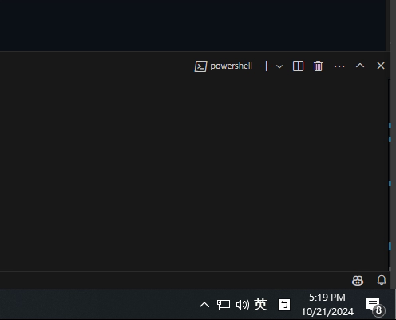

# Sound Priority

Sound Priority is a simple application designed to automatically reduce the volume of your music when any other sound is detected.

## Preview


## Features

- Automatically lowers music volume when other sounds are detected.
- Simple and lightweight.
- Easy to configure and use.

## Installation

1. ### Download on [Releases](https://github.com/xiao-e-yun/sound-priority/releases/latest)
  Look for `sound-priority.exe` under `Assets`.

2. ### Build from source
Requirement:
  - Rust >= 1.82.0  
  
Build
```sh
git clone https://github.com/xiao-e-yun/sound-priority/
cd sound-priority
cargo build -r
```
Run
```sh
.\target\release\sound-priority.exe
```